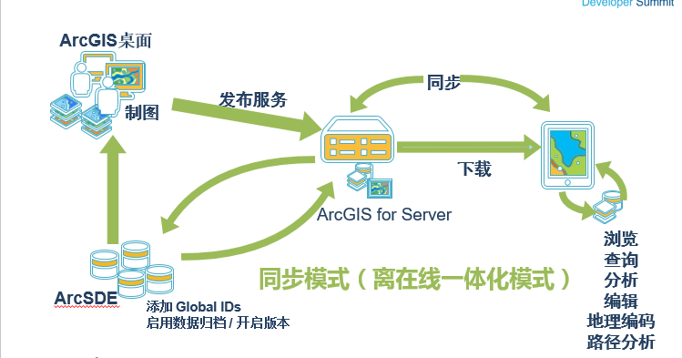
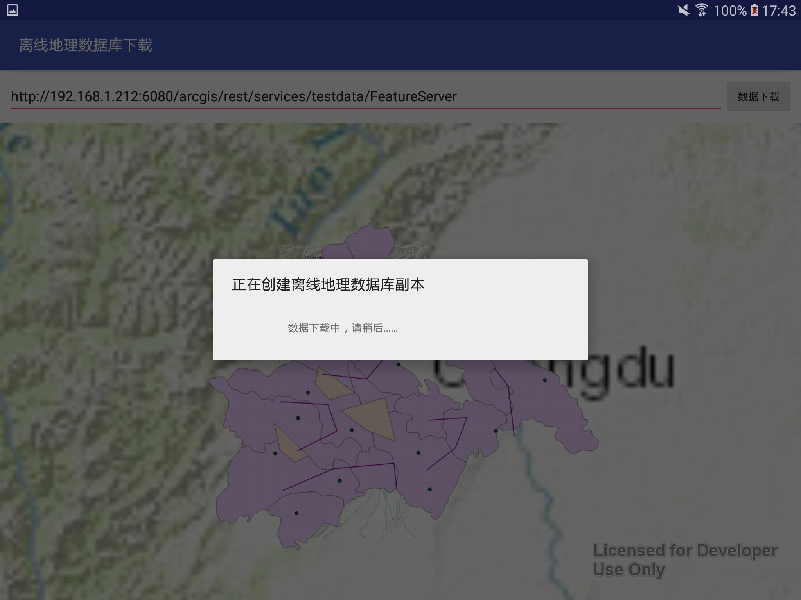
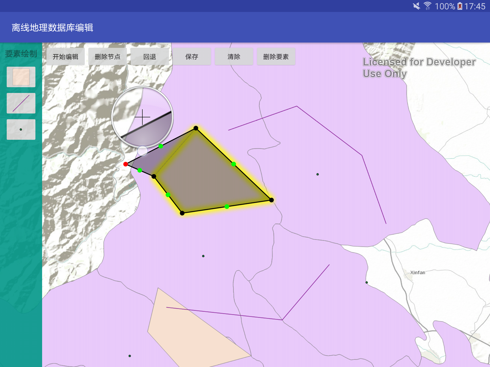
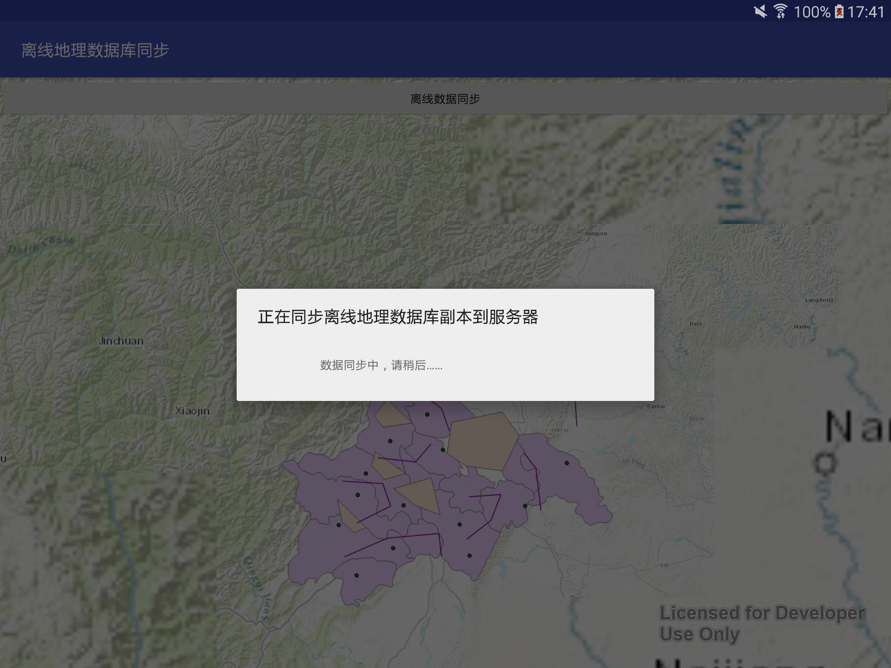

#RuntimeOfflineEdit 
基于ArcGIS Runtime SDK for Android的离在线一体化要素编辑Demo
http://www.cnblogs.com/gis-luq/p/5858043.html

 

### Demo1：离线地理数据库下载
 

### Demo2：离线地理数据库编辑
要素绘制部分采用DrawTools3.0工具实现
 
 
 ### Demo2：离线地理数据库同步
  